<p align="center">
  
</p>

<p align="center">
  <a href="https://llm-evaluation-lab.onrender.com"></a>
  <a href="https://www.linkedin.com/in/ahmed-abdullah-tech-ops/"></a>
  <a href="https://hemedro.github.io/ai-technical-operations-portfolio/"></a>
</p>

## Hello — I am Ahmed

I am a Software Engineering graduate moving from **evaluating AI systems** to **building applied AI products**.

Since June 2025, I have worked on Arabic and English AI-quality projects involving prompt creation, LLM response evaluation, instruction-following, safety, image and voice review, transcription, segmentation, map validation, URL verification, and data collection.

I want to grow inside a technology-first team that experiments, learns, and builds useful new systems.

## Featured build

### [LLM Evaluation Lab](https://llm-evaluation-lab.onrender.com)

<a href="https://llm-evaluation-lab.onrender.com">
  
</a>

A bilingual workspace for creating evaluation datasets, comparing multiple OpenRouter models, reviewing responses, and combining automatic scoring with human judgment.

[**Try the live app →**](https://llm-evaluation-lab.onrender.com) · [**Read the source →**](https://github.com/Hemedro/llm-evaluation-lab)

## What I bring

| AI evaluation | Product thinking | Technical execution |
|---|---|---|
| Arabic/English quality judgment | Turn a rough problem into a workflow | Python, FastAPI, APIs, Git |
| Rubrics, failure modes, safety | Pseudocode and acceptance criteria | React, TypeScript, Docker |
| Text, image, voice and map tasks | Human-in-the-loop design | Testing, debugging and deployment |

## Current engineering focus

```text
Build small → test clearly → inspect failures → improve the system → document what changed
```

- Applied AI systems with real APIs and structured evaluation
- Stronger independent Python, testing, Git, and debugging
- Arabic-English model quality and localization
- Reliable, understandable AI product workflows

<details>
<summary><strong>How I use AI-assisted development</strong></summary>

I use coding assistants heavily. I define the product problem, workflow, data model, evaluation logic, test cases, and acceptance criteria; then I review, test, debug, and iterate on generated code. I am also rebuilding the ability to implement important parts independently instead of hiding behind generated output.

</details>

<details>
<summary><strong>Earlier experience</strong></summary>

- **Programming instructor:** Python, Unity, and web-development fundamentals
- **AI data evaluation:** freelance Arabic/English and multimodal quality work
- **Business systems:** IT support, document control, reporting, and workflow digitization in the UAE

</details>

## Tools I am using

<p>
  
  
  
  
  
  
  
</p>

## Let us build something useful

I am open to junior **Applied AI**, **AI Product Engineering**, **LLM Evaluation**, and **AI Quality Engineering** opportunities worldwide.

- [LinkedIn](https://www.linkedin.com/in/ahmed-abdullah-tech-ops/)
- [Portfolio](https://hemedro.github.io/ai-technical-operations-portfolio/)
- [Email](mailto:ahmedabduahmed2001@gmail.com)
